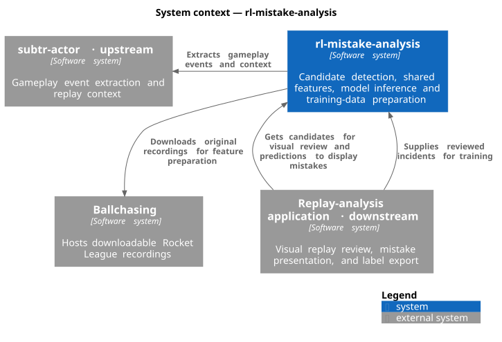
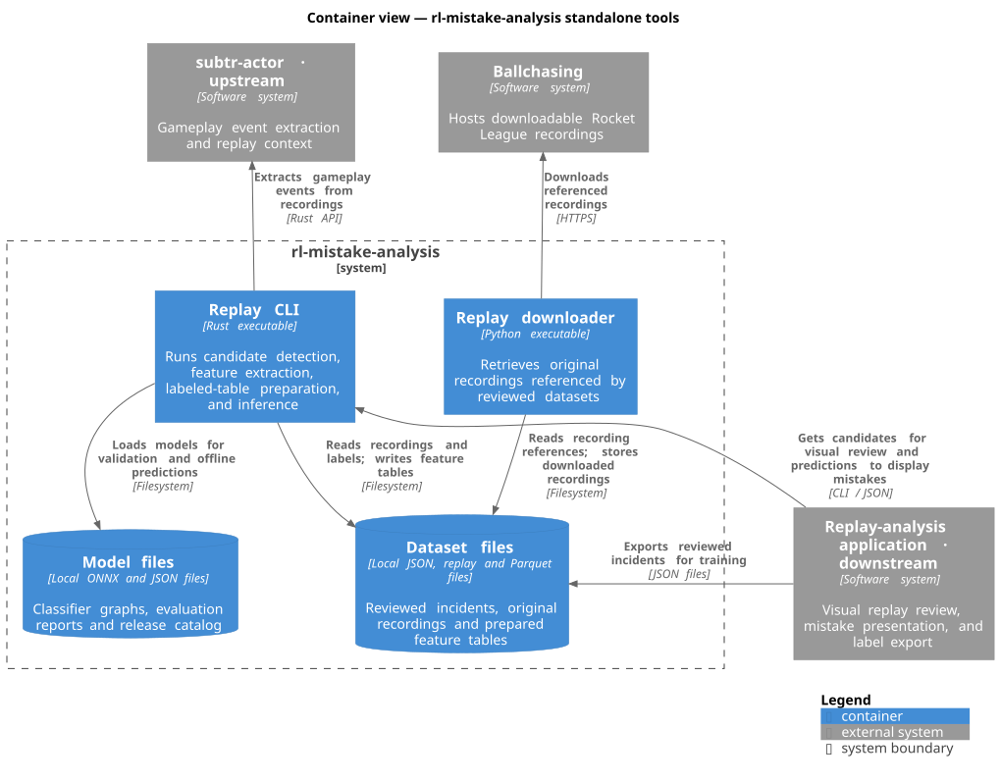

# rl-mistake-analysis

rl-mistake-analysis helps replay-analysis applications identify potential player mistakes in Rocket League and score them with trained models. It also turns human-reviewed incidents into training data, using the same feature calculations that supply the models during inference.

A **candidate** is an incident worth reviewing. **Features** are measurements describing that incident. A **model** uses those measurements to estimate whether the incident is a mistake. Each mistake kind defines its candidates and features; different kinds can use different models.

[subtr-actor](https://github.com/rlrml/subtr-actor) supplies gameplay events and replay context. Downstream applications display incidents, collect reviews, and use predictions. Implemented mistake kinds: `bumping_teammate`.

## Architecture

The context view shows this project and the systems it interacts with. Downstream applications obtain candidates for visual review, use models to present mistakes, and export reviewed datasets for training. This project extracts gameplay events through subtr-actor and downloads original recordings from Ballchasing when preparing training data.



The container view shows a CLI integration. A downstream application invokes the Rust CLI to obtain candidates and predictions. The CLI prepares training tables, and the Python downloader retrieves recordings referenced by reviewed datasets. Rust applications can also import the candidate and inference libraries directly.



## Get started

| What you want | Use |
| --- | --- |
| Unlabeled incidents for review | [Candidate library](#get-unlabeled-candidates) |
| Mistake probabilities from a trained model | [Inference library](#score-candidates-with-a-model) |
| Train with your own labels | [Training tools](#prepare-data-for-training) |
| Process replay files without integrating a library | [Command-line tool](#process-replay-files-from-the-terminal) |

### Get unlabeled candidates

In your Rust application's directory, add the candidate library from GitHub:

```sh
cargo add rl-mistake-analysis-candidates --git https://github.com/assembledev/rl-mistake-analysis.git
```

Cargo fetches and builds the package, recording the source commit in your application's lockfile. Rust 1.92+ is required. You can select a release with `--tag RELEASE_TAG` or a commit with `--rev COMMIT`.

Pass extracted replay events to the library and select a mistake kind:

```rust
use rl_mistake_analysis_candidates::MistakeKind;

let candidates = MistakeKind::BumpingTeammate.candidates(&replay_events)?;
```

`replay_events` contains the supplier's events and recording identity, following [the input contract](docs/formats.md#replay-events). The result contains candidate incidents, their evidence, and features. Labels are supplied by human review.

### Score candidates with a model

Add the inference library to the same application:

```sh
cargo add rl-mistake-analysis-inference --git https://github.com/assembledev/rl-mistake-analysis.git
```

Install CPU ONNX Runtime 1.24+. Before building, set `ORT_LIB_PATH` to its library directory and `ORT_PREFER_DYNAMIC_LINK=1`. The runtime library must also be available to the operating system's dynamic loader when executing inference.

Download a compatible model release and its `manifest.json` catalog into a local model directory. Load the selected kind and version, then score candidates:

```rust
use rl_mistake_analysis_inference::Model;

let mut model = Model::load(model_directory, "bumping_teammate", model_version)?;
let predictions = model.score(candidates)?;
```

Load once and reuse the session. Results contain probabilities, threshold decisions, and model identity. Computation runs inside your application through ONNX Runtime. The application controls model downloads, activation, concurrency, and prediction storage.

### Process replay files from the terminal

The CLI is an executable for offline work: extract events from a recording, inspect candidates, prepare training tables from reviews, or test a model. Install it with Cargo using the same ONNX Runtime setup as inference:

```sh
cargo install --locked --git https://github.com/assembledev/rl-mistake-analysis.git rl-mistake-analysis-cli
rl-mistake-analysis --help
```

For example, extract events and candidates from your own recording:

```sh
mkdir -p artifacts
rl-mistake-analysis events match.replay > artifacts/events.json
rl-mistake-analysis candidates < artifacts/events.json
```

To score those incidents with an installed model:

```sh
rl-mistake-analysis score MODEL_DIRECTORY KIND VERSION < artifacts/events.json
```

The executable reads files or JSON and writes results. Applications importing the libraries call Rust APIs directly.

## Prepare data for training

Work from a checkout of this repository. The Python modules in `training/` download recordings, read prepared feature tables, and generate release metadata. Use them from your model-training scripts.

A consumer exports reviewed incidents using the [annotation contract](docs/formats.md#human-annotations). Each review carries a label and refers to a recording with a download ID and checksum. The ID locates the recording; the checksum verifies its bytes.

With the development environment below activated, build the preparation tool:

```sh
cargo build --locked -p rl-mistake-analysis-cli
```

Validate reviews, retrieve recordings, and prepare one mistake kind's table:

```sh
target/debug/rl-mistake-analysis validate-annotations data/annotations.json
uv run --locked python -m training.fetch_replays data/annotations.json data/replays
target/debug/rl-mistake-analysis prepare data/annotations.json data/replays artifacts/training.parquet KIND
```

Ballchasing downloads require `BALLCHASING_TOKEN`. Preparation parses each recording once, matches reviews to incidents, and recalculates features using the candidate library. Every selected review must match before saving the table.

Read the resulting Parquet table in Python:

```python
from training.dataset import arrays, load

table, contract = load("artifacts/training.parquet")
X, y, replay_groups = arrays(table, contract)
```

`X` contains features, `y` contains labels, and `replay_groups` identifies recordings for grouped training and evaluation splits. Training reads this table without parsing replays. Downloaded recordings in `data/` and generated tables in `artifacts/` are ignored by Git.

## Release models

Code and models have independent versions. One `manifest.json` catalog can list several releases of each mistake kind. Each entry describes its feature contract, threshold, evaluation report, and artifact checksums.

`training.export.model_entry` generates metadata from an exported ONNX model, a prepared table, and an evaluation report. `training.export.write_manifest` writes the catalog. Publish the catalog and artifacts to a Hugging Face model repository; consumers download the files for selected releases.

## Develop and contribute

From this repository's directory:

```sh
nix develop
uv sync --locked --group notebooks
source .venv/bin/activate
```

Nix provides the development tools and native ONNX Runtime. With direnv and nix-direnv installed, `direnv allow` activates the environment and `.venv` automatically. Run `jupyter lab` to use notebooks.

Nix is optional. If you prefer another environment, install Rust 1.92+, Python 3.12+, uv, Ruff, and CPU ONNX Runtime 1.24+. Configure the runtime as described above, then synchronize Python dependencies with `uv sync --locked --group notebooks`.

Run the same checks as CI:

```sh
cargo fmt --all --check
cargo clippy --locked --all-targets -- -D warnings
cargo test --locked -- --test-threads=1
ruff check .
ruff format --check .
uv run --locked pytest
```

Regenerate diagrams with PlantUML and Graphviz installed:

```sh
plantuml -tsvg -failfast2 docs/architecture/*.puml
```

Report problems through the repository's issue tracker, including the command and error output.

## License

[MIT](LICENSE).
